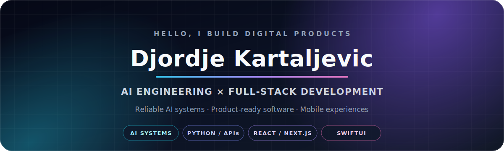

  

  
  
  

  I turn ambitious ideas into testable, deployable products—across AI workflows, web platforms, and mobile applications.

## What I build

<table>
<tr>
<td width="33%" valign="top">

### AI systems

RAG, structured LLM outputs, agent workflows, computer vision, evaluation, and automation with dependable boundaries.

</td>
<td width="33%" valign="top">

### Full-stack products

Responsive interfaces, APIs, authentication, payments, background jobs, data, deployment, and iteration.

</td>
<td width="33%" valign="top">

### Mobile experiences

Product-focused iOS and Android work using Swift, SwiftUI, UIKit, Kotlin, Firebase, and thoughtful UX.

</td>
</tr>
</table>

## Featured work

<table>
<tr>
<td width="50%" valign="top">

### [LoveGift](https://www.lovegift.love)

A live personalized-gifting product with checkout, shareable delivery, QR flows, and production deployment.

`SaaS` `Web` `Payments` `Product`

</td>
<td width="50%" valign="top">

### [Audiobook Pipeline](https://github.com/Djordje3002/audiobook_pipeline)

A creator-focused AI workflow for transcription, translation, multilingual narration, jobs, storage, and billing.

`Python` `Flask` `React` `OpenAI` `Redis / RQ`

</td>
</tr>
<tr>
<td width="50%" valign="top">

### [IBM RAG & Agentic AI Showcase](https://github.com/Djordje3002/ibm-rag-agentic-ai-showcase)

Reliable extraction and agentic-AI coursework with typed outputs, validation, tests, and CI.

`Python` `Pydantic` `watsonx.ai` `Granite`

</td>
<td width="50%" valign="top">

### [Real-Time Gender Fusion](https://github.com/Djordje3002/realtime-gender-fusion)

Computer-vision fusion with confidence weighting, tracking, smoothing, and explicit uncertainty handling.

`PyTorch` `OpenCV` `MediaPipe` `YOLO`

</td>
</tr>
<tr>
<td width="50%" valign="top">

### [OutZone](https://github.com/Djordje3002/OutZone)

A product concept for gamified social-confidence challenges and AI-assisted reflection.

`iOS` `SwiftUI` `Product Design`

</td>
<td width="50%" valign="top">

### [TihiHeroj](https://github.com/Djordje3002/TihiHeroj)

Privacy-conscious violence-reporting flows, localization, and sensitive mobile UX.

`Swift` `SwiftUI` `Firebase`

</td>
</tr>
</table>

## Engineering approach

I care about more than making a demo run. My strongest repositories aim for explicit architecture, reproducible setup, validation and automated checks, honest limitations, and a result that another engineer can evaluate quickly.

**Core stack:** Python · Flask · Node.js · React · Next.js · TypeScript · Swift · SwiftUI · Kotlin · Firebase · Supabase · Redis · GitHub Actions

> **Currently building toward:** a production-grade LangGraph project with explicit state, dependable tool contracts, evaluation, memory, observability, and human approval at consequential steps.

## Let's connect

If you are building an AI product, SaaS platform, or mobile experience, connect with me on [LinkedIn](https://www.linkedin.com/in/djordje-kartaljevic-50b333298/) or explore the work above.
